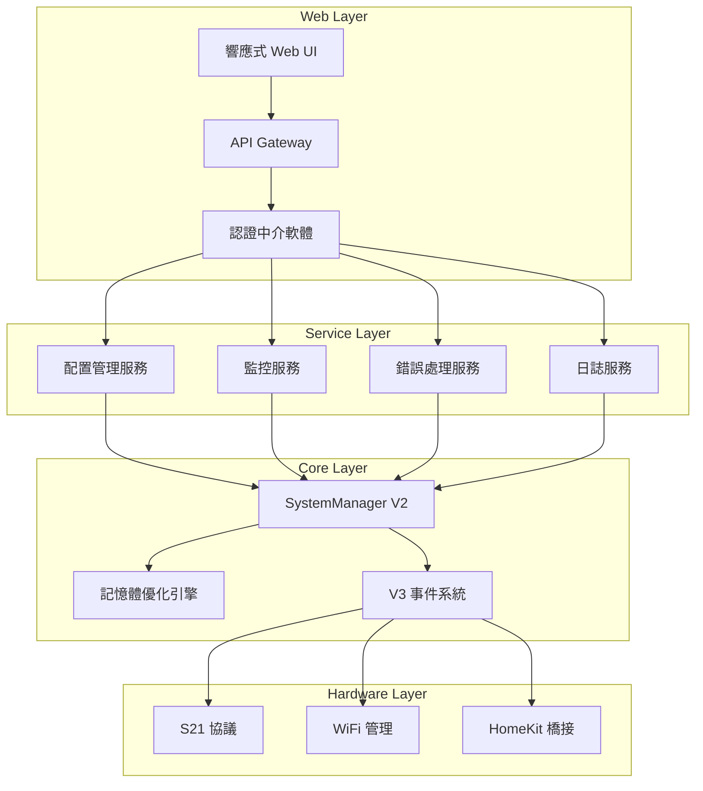
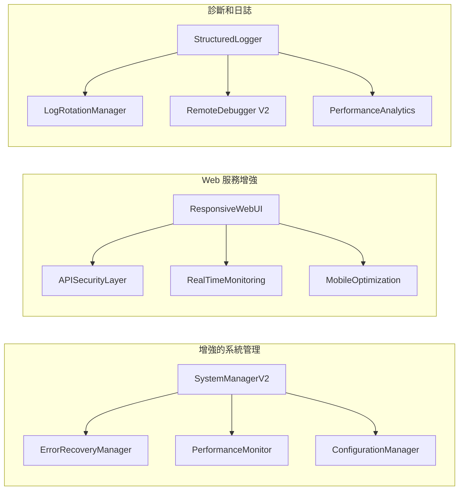

# DaiSpan 優先級改進設計文件

## 概述

本設計文件詳細說明了 DaiSpan 優先級改進的技術架構和實施方案。基於現有的 V3 事件驅動架構和記憶體優化框架，我們將實施七個核心改進項目，以提升系統穩定性、性能和用戶體驗。

## 架構

### 整體架構圖



### 核心組件架構



## 組件和介面

### 1. Flash 記憶體優化引擎

#### FlashOptimizer 類別
```cpp
class FlashOptimizer {
public:
    struct OptimizationResult {
        size_t originalSize;
        size_t optimizedSize;
        float compressionRatio;
        std::vector<String> removedComponents;
    };
    
    // 分析當前 Flash 使用情況
    FlashUsageReport analyzeUsage();
    
    // 執行優化
    OptimizationResult optimize();
    
    // 移除未使用的組件
    bool removeUnusedComponents(const std::vector<String>& components);
    
    // 壓縮資源
    bool compressResources();
    
private:
    void scanUnusedCode();
    void optimizeWebAssets();
    void compressStrings();
};
```

#### 資源壓縮策略
- **HTML/CSS/JS 壓縮**: 移除空白字符和註釋
- **圖片優化**: 使用更高效的編碼格式
- **字串池化**: 重複字串的統一管理
- **死代碼消除**: 編譯時移除未使用的代碼

### 2. 智能錯誤處理和恢復系統

#### ErrorRecoveryManager 類別
```cpp
class ErrorRecoveryManager {
public:
    enum class ErrorType {
        WIFI_DISCONNECTION,
        S21_COMMUNICATION_FAILURE,
        HOMEKIT_PAIRING_ERROR,
        MEMORY_EXHAUSTION,
        SYSTEM_OVERLOAD
    };
    
    enum class RecoveryStrategy {
        IMMEDIATE_RETRY,
        EXPONENTIAL_BACKOFF,
        SAFE_MODE,
        SYSTEM_RESTART
    };
    
    // 註冊錯誤處理器
    void registerErrorHandler(ErrorType type, 
                             std::function<bool()> handler);
    
    // 處理錯誤
    bool handleError(ErrorType type, const String& context);
    
    // 獲取恢復策略
    RecoveryStrategy getRecoveryStrategy(ErrorType type, int attemptCount);
    
    // 進入安全模式
    void enterSafeMode();
    
private:
    struct ErrorContext {
        ErrorType type;
        String message;
        unsigned long timestamp;
        int attemptCount;
    };
    
    std::map<ErrorType, std::function<bool()>> errorHandlers;
    std::vector<ErrorContext> errorHistory;
    bool safeMode = false;
};
```

#### 恢復策略實施
```cpp
class WiFiRecoveryHandler {
public:
    bool handleDisconnection() {
        // 1. 檢查網路狀態
        if (!WiFi.isConnected()) {
            // 2. 嘗試重連
            return attemptReconnection();
        }
        return true;
    }
    
private:
    bool attemptReconnection() {
        for (int i = 0; i < 3; i++) {
            WiFi.reconnect();
            delay(5000 * (i + 1)); // 遞增延遲
            if (WiFi.isConnected()) {
                return true;
            }
        }
        return false;
    }
};
```

### 3. 實時性能監控系統

#### PerformanceMonitor 類別
```cpp
class PerformanceMonitor {
public:
    struct SystemMetrics {
        uint32_t freeHeap;
        uint32_t maxAllocHeap;
        float cpuUsage;
        int wifiSignalStrength;
        unsigned long uptime;
        float temperature;
    };
    
    struct HistoricalData {
        std::vector<SystemMetrics> last24Hours;
        std::vector<SystemMetrics> lastWeek;
        SystemMetrics averages;
    };
    
    // 收集即時指標
    SystemMetrics collectMetrics();
    
    // 獲取歷史數據
    HistoricalData getHistoricalData();
    
    // 檢查系統健康狀態
    bool performHealthCheck();
    
    // 設定警報閾值
    void setAlertThresholds(const SystemMetrics& thresholds);
    
    // 檢查是否需要警報
    std::vector<String> checkAlerts(const SystemMetrics& current);
    
private:
    void updateHistoricalData(const SystemMetrics& metrics);
    float calculateCpuUsage();
    void cleanOldData();
};
```

#### 監控 API 端點
```cpp
// 新增 API 端點
server.on("/api/v2/metrics/realtime", HTTP_GET, [](AsyncWebServerRequest *request) {
    auto metrics = performanceMonitor.collectMetrics();
    String json = serializeMetrics(metrics);
    request->send(200, "application/json", json);
});

server.on("/api/v2/metrics/historical", HTTP_GET, [](AsyncWebServerRequest *request) {
    auto data = performanceMonitor.getHistoricalData();
    String json = serializeHistoricalData(data);
    request->send(200, "application/json", json);
});

server.on("/api/v2/health", HTTP_GET, [](AsyncWebServerRequest *request) {
    bool healthy = performanceMonitor.performHealthCheck();
    auto alerts = performanceMonitor.checkAlerts(
        performanceMonitor.collectMetrics()
    );
    
    JsonDocument doc;
    doc["healthy"] = healthy;
    doc["alerts"] = alerts;
    
    String response;
    serializeJson(doc, response);
    request->send(200, "application/json", response);
});
```

### 4. 響應式 Web 介面

#### ResponsiveWebUI 類別
```cpp
class ResponsiveWebUI {
public:
    enum class DeviceType {
        DESKTOP,
        TABLET,
        MOBILE
    };
    
    // 檢測設備類型
    DeviceType detectDeviceType(const String& userAgent);
    
    // 生成響應式 HTML
    String generateResponsiveHTML(const String& templateName, 
                                 DeviceType deviceType);
    
    // 優化資源載入
    String optimizeAssets(DeviceType deviceType);
    
    // 生成移動優化的控制介面
    String generateMobileControls();
    
private:
    String loadTemplate(const String& templateName);
    String applyResponsiveCSS(DeviceType deviceType);
    String generateProgressiveWebApp();
};
```

#### CSS 響應式框架
```css
/* 響應式設計 CSS */
.container {
    max-width: 1200px;
    margin: 0 auto;
    padding: 0 15px;
}

/* 平板樣式 */
@media (max-width: 768px) {
    .container {
        padding: 0 10px;
    }
    
    .control-panel {
        flex-direction: column;
    }
    
    .metric-card {
        width: 100%;
        margin-bottom: 10px;
    }
}

/* 手機樣式 */
@media (max-width: 480px) {
    .header {
        font-size: 1.2em;
    }
    
    .button {
        width: 100%;
        padding: 15px;
        font-size: 16px;
    }
    
    .metric-grid {
        grid-template-columns: 1fr;
    }
}
```

### 5. 配置管理系統

#### ConfigurationManager 類別
```cpp
class ConfigurationManager {
public:
    struct ConfigBackup {
        String timestamp;
        String version;
        JsonDocument config;
        String checksum;
    };
    
    // 載入配置
    bool loadConfiguration();
    
    // 保存配置
    bool saveConfiguration();
    
    // 動態更新配置
    bool updateConfiguration(const String& key, const String& value);
    
    // 創建備份
    ConfigBackup createBackup();
    
    // 恢復配置
    bool restoreFromBackup(const ConfigBackup& backup);
    
    // 驗證配置
    bool validateConfiguration(const JsonDocument& config);
    
    // 獲取配置值
    template<typename T>
    T getConfigValue(const String& key, const T& defaultValue);
    
private:
    JsonDocument currentConfig;
    std::vector<ConfigBackup> backupHistory;
    
    bool writeToFlash(const JsonDocument& config);
    JsonDocument readFromFlash();
    String calculateChecksum(const JsonDocument& config);
};
```

### 6. API 安全性系統

#### APISecurityLayer 類別
```cpp
class APISecurityLayer {
public:
    struct AuthToken {
        String token;
        unsigned long expiry;
        String permissions;
    };
    
    struct RateLimitInfo {
        String clientIP;
        int requestCount;
        unsigned long windowStart;
        bool blocked;
    };
    
    // 生成認證令牌
    AuthToken generateToken(const String& clientInfo);
    
    // 驗證令牌
    bool validateToken(const String& token);
    
    // 檢查速率限制
    bool checkRateLimit(const String& clientIP);
    
    // 記錄安全事件
    void logSecurityEvent(const String& event, const String& clientIP);
    
    // 檢查 IP 是否被封鎖
    bool isIPBlocked(const String& clientIP);
    
private:
    std::map<String, AuthToken> activeTokens;
    std::map<String, RateLimitInfo> rateLimits;
    std::set<String> blockedIPs;
    
    void cleanExpiredTokens();
    void updateRateLimit(const String& clientIP);
};
```

### 7. 增強的日誌系統

#### StructuredLogger 類別
```cpp
class StructuredLogger {
public:
    enum class LogLevel {
        DEBUG = 0,
        INFO = 1,
        WARN = 2,
        ERROR = 3,
        FATAL = 4
    };
    
    struct LogEntry {
        unsigned long timestamp;
        LogLevel level;
        String component;
        String message;
        JsonDocument context;
    };
    
    // 記錄日誌
    void log(LogLevel level, const String& component, 
             const String& message, const JsonDocument& context = JsonDocument());
    
    // 設定日誌級別
    void setLogLevel(LogLevel level);
    
    // 獲取日誌
    std::vector<LogEntry> getLogs(LogLevel minLevel = LogLevel::INFO, 
                                 int maxEntries = 100);
    
    // 日誌輪替
    void rotateLogs();
    
    // 清理舊日誌
    void cleanOldLogs(int daysToKeep = 7);
    
private:
    LogLevel currentLogLevel = LogLevel::INFO;
    std::vector<LogEntry> logBuffer;
    size_t maxBufferSize = 1000;
    
    void writeLogToFlash(const LogEntry& entry);
    String formatLogEntry(const LogEntry& entry);
};
```

## 數據模型

### 系統配置模型
```cpp
struct SystemConfiguration {
    // 網路設定
    struct NetworkConfig {
        String ssid;
        String password;
        String hostname;
        bool staticIP;
        String ipAddress;
        String gateway;
        String subnet;
    } network;
    
    // HomeKit 設定
    struct HomeKitConfig {
        String deviceName;
        String pairingCode;
        bool autoRestart;
        int maxConnections;
    } homekit;
    
    // 監控設定
    struct MonitoringConfig {
        int metricsInterval;
        int historyRetention;
        bool enableAlerts;
        SystemMetrics alertThresholds;
    } monitoring;
    
    // 安全設定
    struct SecurityConfig {
        bool enableAuth;
        int tokenExpiry;
        int rateLimitWindow;
        int maxRequestsPerWindow;
    } security;
};
```

### 性能指標模型
```cpp
struct PerformanceMetrics {
    // 系統資源
    uint32_t freeHeap;
    uint32_t totalHeap;
    uint32_t maxAllocHeap;
    float heapFragmentation;
    
    // CPU 和處理
    float cpuUsage;
    unsigned long uptime;
    int taskCount;
    
    // 網路
    int wifiSignalStrength;
    String wifiSSID;
    String ipAddress;
    uint32_t bytesReceived;
    uint32_t bytesSent;
    
    // HomeKit
    int homeKitConnections;
    float avgResponseTime;
    int totalRequests;
    int errorCount;
    
    // 溫度和環境
    float chipTemperature;
    float ambientTemperature;
    float humidity;
};
```

## 錯誤處理

### 錯誤分類和處理策略

#### 1. 網路錯誤
```cpp
class NetworkErrorHandler {
public:
    bool handleWiFiDisconnection() {
        // 1. 記錄錯誤
        logger.log(LogLevel::WARN, "Network", "WiFi disconnected");
        
        // 2. 嘗試重連
        for (int attempt = 1; attempt <= 3; attempt++) {
            if (attemptReconnection(attempt)) {
                logger.log(LogLevel::INFO, "Network", 
                          "WiFi reconnected on attempt " + String(attempt));
                return true;
            }
            delay(5000 * attempt); // 遞增延遲
        }
        
        // 3. 進入離線模式
        enterOfflineMode();
        return false;
    }
    
private:
    bool attemptReconnection(int attempt);
    void enterOfflineMode();
};
```

#### 2. 記憶體錯誤
```cpp
class MemoryErrorHandler {
public:
    bool handleMemoryExhaustion() {
        // 1. 立即清理
        performEmergencyCleanup();
        
        // 2. 檢查可用記憶體
        uint32_t freeHeap = ESP.getFreeHeap();
        if (freeHeap < CRITICAL_MEMORY_THRESHOLD) {
            // 3. 進入最小功能模式
            enterMinimalMode();
            return false;
        }
        
        return true;
    }
    
private:
    void performEmergencyCleanup();
    void enterMinimalMode();
    static const uint32_t CRITICAL_MEMORY_THRESHOLD = 10000;
};
```

#### 3. 協議錯誤
```cpp
class ProtocolErrorHandler {
public:
    bool handleS21CommunicationError() {
        // 1. 重置連接
        s21Protocol.reset();
        
        // 2. 重新初始化
        if (!s21Protocol.initialize()) {
            // 3. 切換到模擬模式
            switchToSimulationMode();
            return false;
        }
        
        return true;
    }
    
private:
    void switchToSimulationMode();
};
```

## 測試策略

### 1. 單元測試
```cpp
// Flash 優化測試
TEST(FlashOptimizerTest, AnalyzeUsage) {
    FlashOptimizer optimizer;
    auto report = optimizer.analyzeUsage();
    
    EXPECT_LT(report.usagePercentage, 90.0f);
    EXPECT_GT(report.availableSpace, 100000);
}

// 錯誤處理測試
TEST(ErrorRecoveryTest, WiFiDisconnection) {
    ErrorRecoveryManager manager;
    
    // 模擬 WiFi 斷線
    WiFi.disconnect();
    
    bool recovered = manager.handleError(
        ErrorRecoveryManager::ErrorType::WIFI_DISCONNECTION, 
        "Test disconnection"
    );
    
    EXPECT_TRUE(recovered);
    EXPECT_TRUE(WiFi.isConnected());
}
```

### 2. 整合測試
```cpp
// 監控系統整合測試
TEST(MonitoringIntegrationTest, RealTimeMetrics) {
    PerformanceMonitor monitor;
    ResponsiveWebUI webUI;
    
    // 啟動監控
    monitor.start();
    
    // 模擬 Web 請求
    auto response = webUI.handleMetricsRequest();
    
    EXPECT_TRUE(response.contains("freeHeap"));
    EXPECT_TRUE(response.contains("cpuUsage"));
}
```

### 3. 壓力測試
```cpp
// 記憶體壓力測試
TEST(MemoryStressTest, HighLoad) {
    const int TEST_DURATION = 3600; // 1 小時
    const int INTERVAL = 1000; // 1 秒
    
    for (int i = 0; i < TEST_DURATION; i += INTERVAL) {
        // 模擬高負載
        simulateHighMemoryUsage();
        
        // 檢查系統穩定性
        EXPECT_TRUE(system.isStable());
        EXPECT_GT(ESP.getFreeHeap(), 20000);
        
        delay(INTERVAL);
    }
}
```

## 部署和維護

### 1. 漸進式部署
- **階段 1**: Flash 優化和錯誤處理
- **階段 2**: 監控系統和 Web 介面
- **階段 3**: 配置管理和安全性
- **階段 4**: 日誌系統和最終整合

### 2. 監控和警報
- **系統健康監控**: 每分鐘檢查一次
- **性能指標收集**: 每 30 秒收集一次
- **錯誤警報**: 即時通知
- **容量警報**: 當資源使用超過 80% 時警報

### 3. 維護程序
- **日誌輪替**: 每日執行
- **配置備份**: 每週執行
- **性能分析**: 每月執行
- **安全審計**: 每季執行

這個設計提供了完整的技術架構，確保所有需求都能得到滿足，同時保持系統的穩定性和可擴展性。